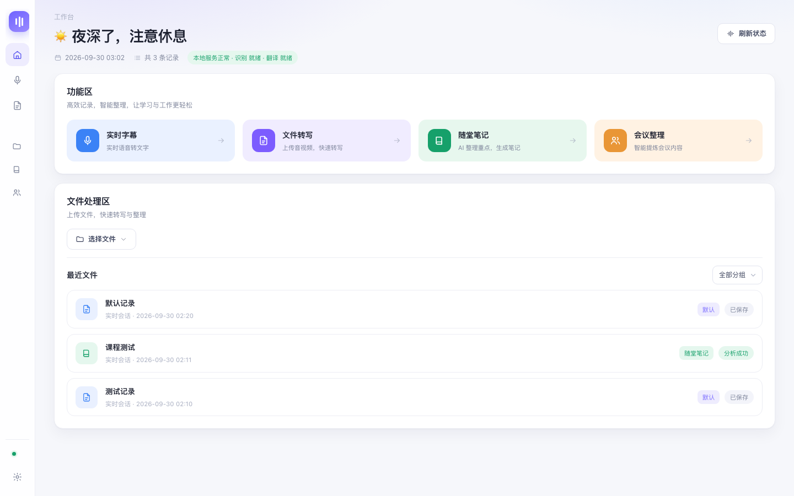
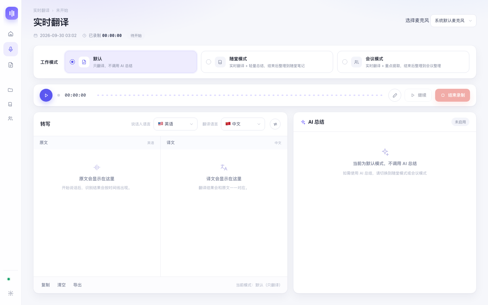
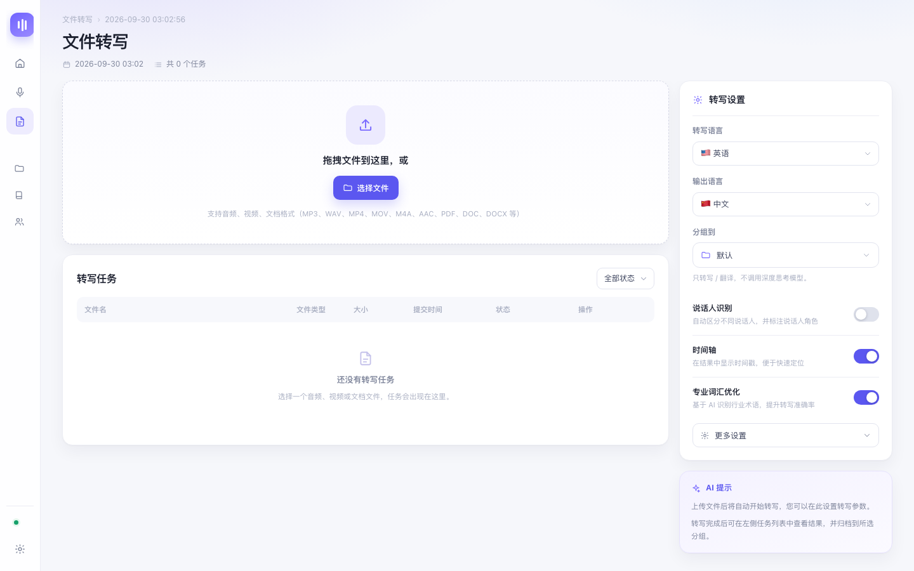
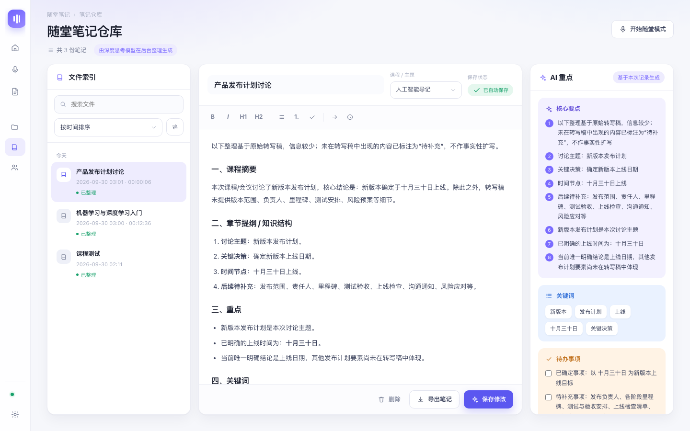
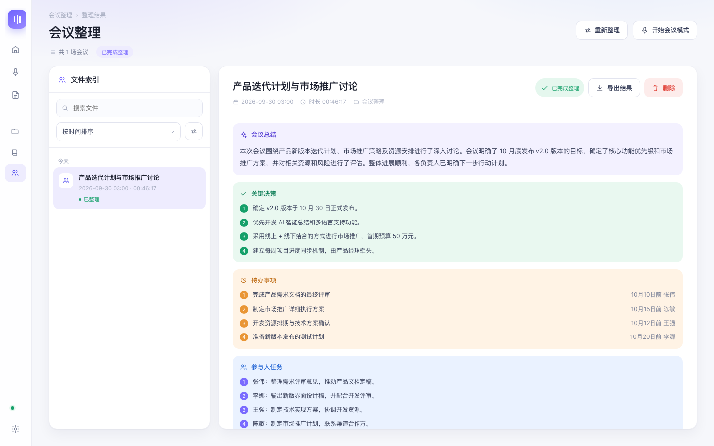

# 绘梦subtitle

> 一款 macOS 桌面端的**实时语音翻译 + 智能整理**工具：边说边出译文，结束后自动整理成随堂笔记或会议纪要。

它不是网页、不是 Demo —— 是一个真正能双击运行、能打包分发的桌面应用。



---

## 它能做什么

| 功能 | 说明 |
|---|---|
| **实时翻译** | 麦克风采集 → 云端实时同传（百炼 LiveTranslate）→ 原文/译文双栏**边说边出**。本地模式则走 whisper 离线转写 + 云端翻译 |
| **三种工作模式** | **默认**只翻译不调 AI；**随堂模式**实时提炼重点、结束后整理成课堂笔记；**会议模式**结束后整理出摘要/决策/待办/参与人任务 |
| **文件转写** | 拖入音频、视频或文档 → 后台任务队列转写 → 翻译 → 按分组归档；带进度、重试、结果查看 |
| **三个归档仓库** | 默认（原始记录）／随堂笔记（三栏编辑器 + AI 重点）／会议整理（分色块纪要） |
| **AI 总结可调** | 实时总结基于「译文／原文／双语」可选；深度整理默认「译文为主，关键术语与决策处附原文」，便于查证 |
| **三个模型独立配置** | 深度思考／轻量实时／专用翻译各配各的服务商、模型、API Key 与**思考强度** |
| **内置更新** | 设置 → 关于／更新：检查新版本、带进度下载、一键重启安装 |

<table>
<tr>
<td width="50%"></td>
<td width="50%"></td>
</tr>
<tr>
<td width="50%"></td>
<td width="50%"></td>
</tr>
</table>

---

## 快速开始

### 方式一：下载安装包（推荐给普通用户）

1. 到 [**Releases**](https://github.com/yuanyiHY/huimeng-subtitle/releases) 页下载最新的 `绘梦subtitle-vX.Y.Z.dmg`
2. 打开 DMG，把「绘梦subtitle」拖进「应用程序」
3. **首次打开需要手动放行**：在「应用程序」里按住 `Control` 点图标 → 选「打开」→ 再点一次「打开」
   （本应用没有 Apple 开发者证书，这是正常现象，之后双击即可）

### 方式二：从源码运行（开发者）

```bash
git clone https://github.com/yuanyiHY/huimeng-subtitle.git
cd huimeng-subtitle

python3 -m venv .venv
.venv/bin/pip install -r requirements.txt

cp .env.example .env      # 按下面「配置模型」填好 Key
.venv/bin/python run.py            # 浏览器模式（开发调试）
.venv/bin/python run.py --window   # 原生窗口模式
```

打包成分发给别人的 DMG：

```bash
./build-dmg.sh        # 产出 dist/绘梦subtitle-v<版本>.dmg
```

详见 [打包与分发说明.md](打包与分发说明.md)。

---

## 系统要求

- **Apple 芯片的 Mac**（M1/M2/M3/M4）
- **macOS 13.0+**
- 本地语音识别依赖 Apple 的 [MLX](https://github.com/ml-explore/mlx) 框架，**Intel 机器无法使用本地转写**

---

## 配置模型

应用本身**不含任何 API Key**，需要你自己配置。打开「设置 → 模型设置」，各模型分工如下：

| 模型 | 负责什么 | 推荐 |
|---|---|---|
| **深度思考模型** | 会议整理、随堂笔记等后台深度整理 | DeepSeek `deepseek-chat` 等，思考强度建议「深度」 |
| **轻量实时模型** | 录音过程中的实时重点提炼 | 任意快速模型，**思考强度建议「关闭」**，否则实时性会明显变差 |
| **专用翻译模型** | 文件转写与本地模式的翻译 | 阿里云百炼 `qwen-mt-lite`（便宜且质量好） |
| **实时同传模型** | 打开「实时同传模式」时的口语翻译 | 百炼 `qwen3.5-livetranslate-flash-realtime` 或 `qwen3.8-livetranslate-flash-realtime`（同价） |

> **关于成本**：实时同传按音频时长计费，是唯一持续花钱的部分；本地 whisper 转写免费，
> 翻译按 token 计费也很低。省钱策略：**实时场景用云端，事后处理用本地**。
>
> 实测参考（阿里云百炼官方价）：LiveTranslate 端到端约 5.6 元/小时，
> 而「paraformer 转写 + qwen-mt-flash 翻译」两段式约 0.3 元/小时，代价是延迟更高。

### 更新源（可选）

`config.yaml` 里的 `update.feed_url` 指向一个 JSON，用于「检查更新」：

```yaml
update:
  feed_url: "https://github.com/yuanyiHY/huimeng-subtitle/releases/latest/download/latest.json"
```

JSON 格式：

```json
{
  "version": "3.3.0",
  "download_url": "https://…/绘梦subtitle-v3.3.0.dmg",
  "size": 598000000,
  "notes": "本次更新内容…"
}
```

**国内网络提示**：`raw.githubusercontent.com` 在国内经常无法解析，
所以更新源不要放在 raw 域名上，用 Release 的固定地址即可：

```
https://github.com/<用户名>/<仓库>/releases/latest/download/latest.json
```

如果连 `github.com` 也不稳定（会给朋友分发时常见），可以把这两个文件
（`latest.json` 与 DMG）放到**任意静态托管**上——阿里云 OSS、腾讯云 COS、
又或者自己的服务器都行，然后把 `feed_url` 改成对应地址即可，程序不关心托管在哪。

---

## 技术架构

```
┌──────────────────── 桌面窗口（pywebview / 浏览器）────────────────────┐
│  frontend/   原生 HTML + CSS + JS（无框架），单页外壳 + 多个视图        │
└───────────────────────────────┬──────────────────────────────────────┘
                                │ HTTP / WebSocket（127.0.0.1）
┌───────────────────────────────┴──────────────────────────────────────┐
│  backend/   FastAPI                                                  │
│   ├─ asr/       本地 mlx-whisper 转写（Apple MLX，离线）              │
│   ├─ mt/        翻译引擎：云端 OpenAI 兼容 / 本地 CT2 / NLLB          │
│   │             + livetranslate_engine.py 百炼实时同传（双向流）       │
│   ├─ live_capture.py  sounddevice 原生麦克风采集                      │
│   │             （打包后的 App 里 WKWebView 没有 mediaDevices，       │
│   │               因此由后端直接采音）                                 │
│   ├─ orchestrator.py  深度思考模型：结构化整理                        │
│   └─ api/       转写 / 翻译 / 采集 / 工作区 / 任务队列 / 模型 / 更新   │
└──────────────────────────────────────────────────────────────────────┘
```

**几个设计取舍：**

- **为什么用 pywebview 而不是 Electron**：后端本来就是 Python（ASR/MLX 生态在 Python 上），
  pywebview 用系统 WebView 承载界面，包体比 Electron 小一个数量级。
- **为什么打包要内置 Python 运行时**：目标用户不该为了用软件去装 Python。
  打包脚本把独立 CPython 与依赖一起塞进 `.app`，并用 `PYTHONHOME` 钉死位置。
  （踩过的坑：内置解释器的二进制里带着编译期路径、venv 的 `pyvenv.cfg` 也是绝对路径，
  不处理的话在打包机上测试正常、换台电脑就找不到标准库。）
- **为什么实时同传用端到端而不是"转写+翻译"两段式**：两段式的译文必须等原文出来才能开始翻，
  后面永远排着一个翻译请求的往返延迟；端到端能把首字延迟压到 1 秒出头。

---

## 目录结构

```
run.py                  入口：起后端 + 打开窗口
config.yaml             引擎 / 模型 / 端口 / 更新源
build-dmg.sh            自包含打包脚本（产出可分发的 DMG）
backend/                FastAPI 后端（见上方架构图）
frontend/               原生前端：index.html / style.css / app.js
docs/screenshots/       README 用截图
打包与分发说明.md         打包、分发、更新的完整说明
改造说明-v3.md           版本变更与踩坑记录
```

---

## 常见问题

**Q：首次打开提示「无法验证开发者」？**
没有购买 Apple 开发者证书（99 美元/年）时的正常现象。
在「应用程序」里按住 `Control` 点击图标 → 选「打开」→ 再点「打开」，之后就能正常双击。

**Q：实时翻译没有文字？**
1. 看「设置 → 关于／更新」里的版本，以及实时翻译页页脚显示的是「实时同传」还是「本地转写」
2. 看日志：`~/Library/Logs/绘梦subtitle.log`
3. 如果改过「实时同传模型」，换回默认值试试（不同版本的协议字段可能有差异）

**Q：首次转写很慢？**
第一次需要下载语音识别模型（约 500MB），之后是本地推理、不再联网。
启动器已把 `HF_ENDPOINT` 指向国内镜像。

**Q：数据存在哪？**
```
~/Library/Application Support/intrealtimetranslate/   # 记录、整理结果、模型配置、.env
~/Documents/intrealtimetranslate-recordings/           # 录音 WAV
```
卸载：删掉这两个目录 + 把 App 拖进废纸篓。

---

## 参与开发

欢迎提 Issue 和 PR。提交前请确认：

- **不要提交 `.env`、任何 API Key 或模型权重**（`.gitignore` 已覆盖，提交前仍请自查）
- 前端改动请用浏览器控制台确认无报错
- 涉及采集/翻译链路的改动，建议用「让请求超时」的方式验证降级行为

---

## 许可

[MIT](LICENSE)

> 注意：可选的本地翻译模型 NLLB（`facebook/nllb-200-distilled-600M`）许可是 **CC-BY-NC-4.0（非商用）**，
> 它只在「本地翻译」模式下按需下载，不在本仓库内。商用请改用其他翻译引擎。
